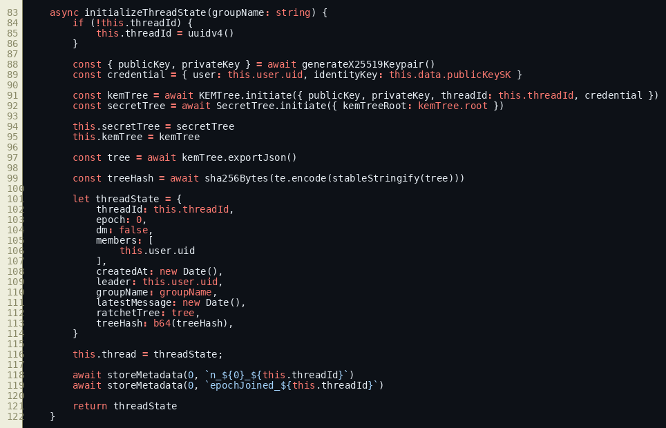
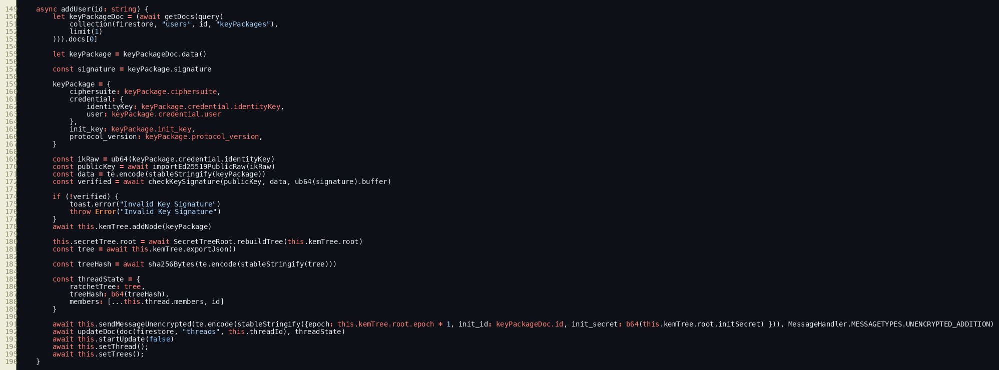
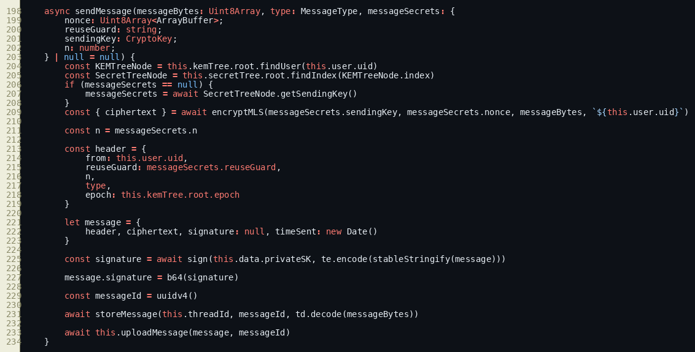
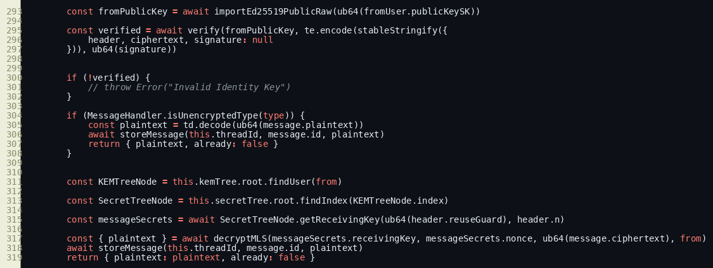
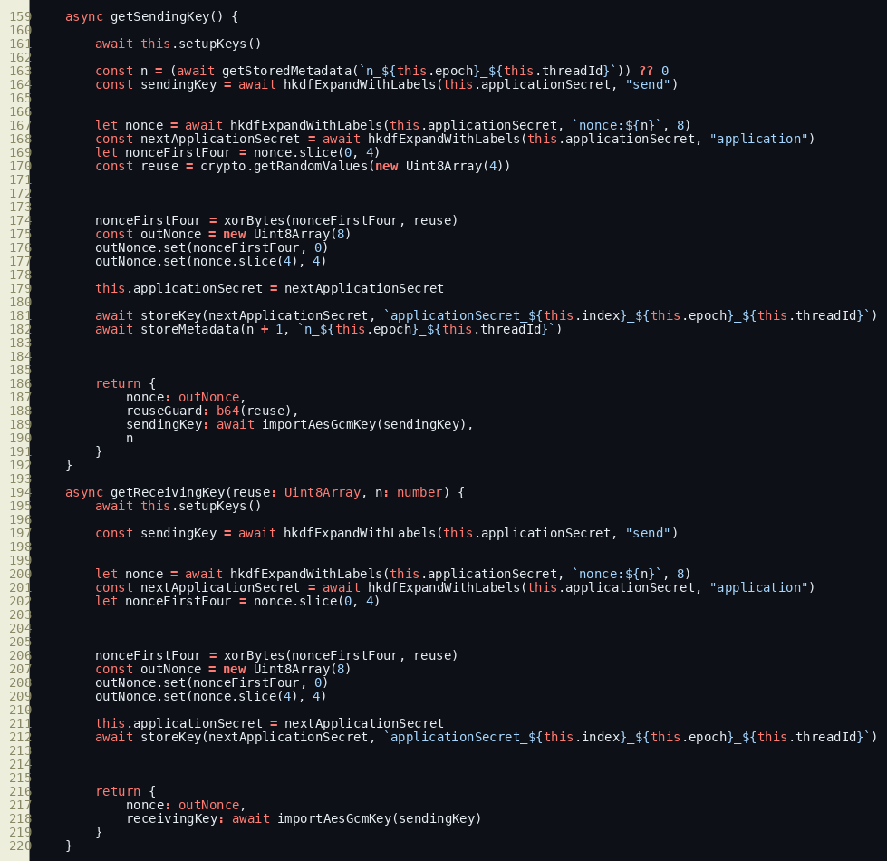
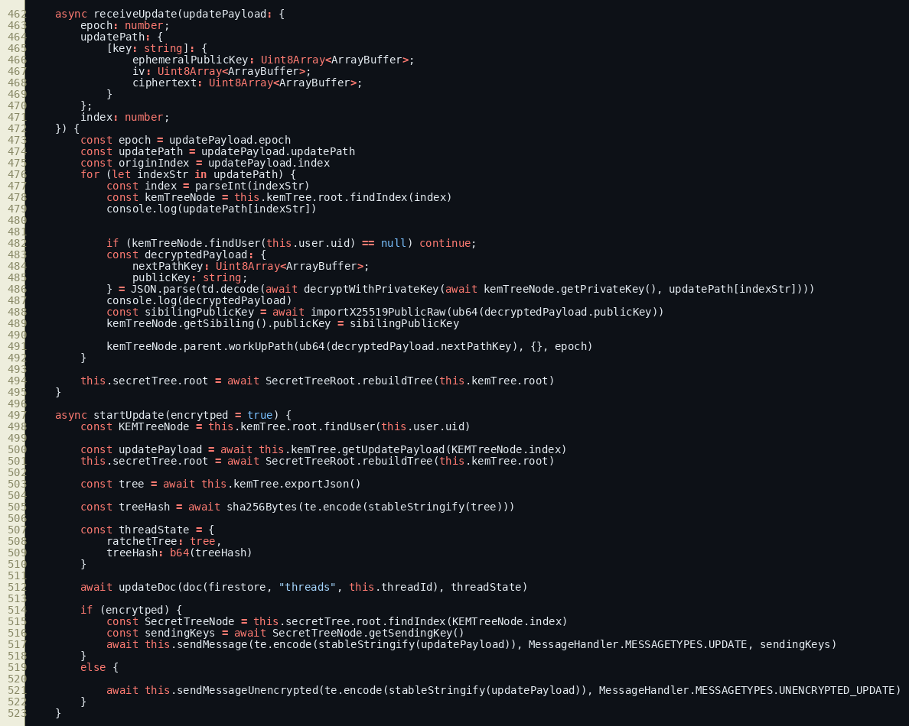
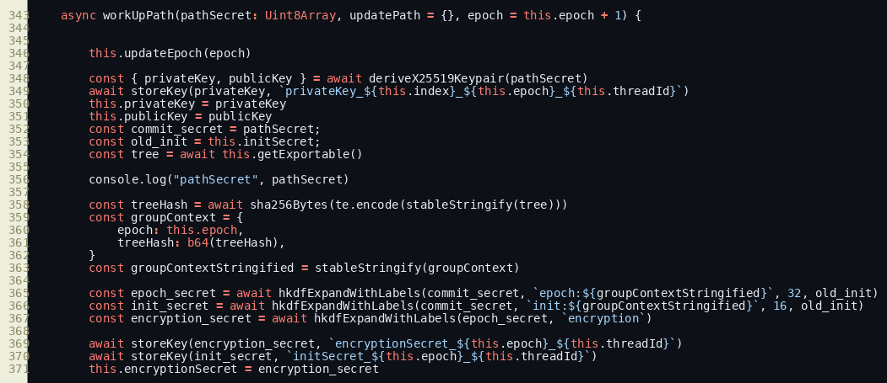
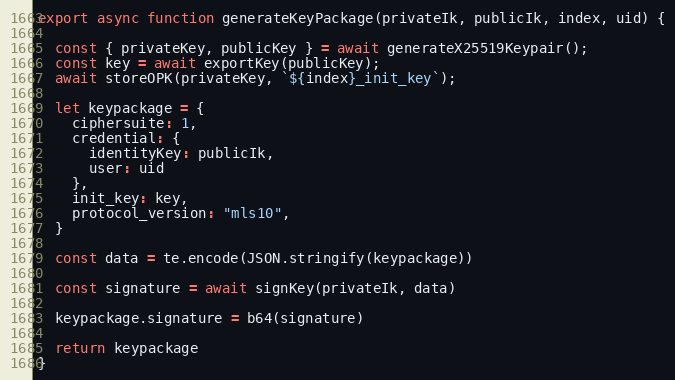
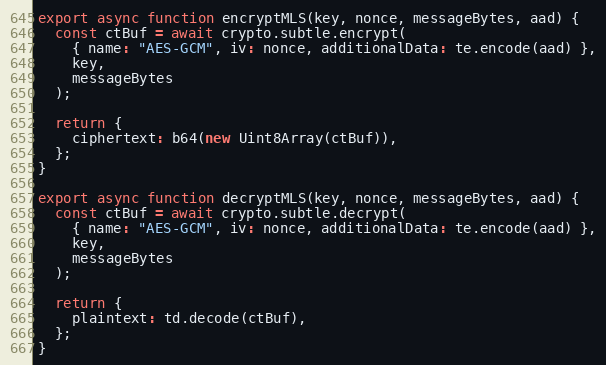

# Group Messaging Protocol Security Analysis

Date: February 11, 2026  
Scope: Group messaging path implemented in `lib/GroupMessageHandler.ts`, `lib/KEMTree.ts`, `lib/SecretTree.ts`, and cryptographic primitives in `lib/e2ee/e2ee.js`.

## 1. Executive Summary

This implementation is a tree-based group E2EE design that combines:
- Per-member leaf key material in a ratchet tree (`KEMTree`)
- Epoch secret derivation from update-path commits
- Per-sender message key evolution from a `SecretTree`
- Message encryption using AES-GCM with sender-bound AAD
- Signed key packages for onboarding new members

At a protocol level, the design aligns closely with MLS-style concepts (ratchet tree, update path, epoch secrets) while using application-specific message/control flows.

The implementation demonstrates strong building blocks for confidentiality and forward secrecy. The main hardening opportunities are in authenticity enforcement, transcript/state consistency checks, and out-of-order/replay handling for group traffic.

## 2. Methodology

This analysis is code-driven (implementation-first), not spec-driven. Findings are derived from runtime-relevant code paths and state transitions in:
- Group state creation and updates
- Member addition and key package validation
- Message encryption/decryption
- Epoch update path processing
- Local key/metadata persistence

## 3. Protocol Architecture

### 3.1 Core Components

- `KEMTree`: Maintains the group ratchet tree and epoch-level secrets.
- `SecretTree`: Derives per-node `applicationSecret` and `handshakeSecret` from epoch material.
- `GroupMessageHandler`: Orchestrates thread lifecycle, add-member flow, messaging, and updates.
- `e2ee.js`: Cryptographic primitives (X25519, Ed25519, HKDF-SHA256, AES-GCM).

### 3.2 Trust/State Layers

- Server-visible state (Firestore): thread membership, ratchet tree public state, message envelopes.
- Client-private state (IndexedDB): private keys, node/application secrets, metadata counters.

### 3.3 Visual Evidence (Implementation Snapshots)

Figure 1: Group initialization and first thread state creation (`GroupMessageHandler.ts:83`).

Figure 2: Add-member path with key package verification and update trigger (`GroupMessageHandler.ts:250`).

Figure 3: Per-message encryption and signature generation (`GroupMessageHandler.ts:299`).

Figure 4: Decrypt-side signature verification branch (`GroupMessageHandler.ts:407`).

Figure 5: Sender/receiver key and nonce derivation (`SecretTree.ts:159`).

Figure 6: Epoch update reception and application (`GroupMessageHandler.ts:587`).

Figure 7: Root epoch/init/encryption secret derivation (`KEMTree.ts:343`).

Figure 8: Signed key package generation (`e2ee.js:1663`).

Figure 9: AES-GCM primitive wrappers for group messages (`e2ee.js:645`).

## 4. Cryptographic Construction

### 4.1 Algorithms and Primitives

- Asymmetric key agreement: X25519
- Signatures: Ed25519
- KDF: HKDF-SHA256 with context labels
- Content encryption: AES-GCM
- Hashing: SHA-256

### 4.2 Message Encryption

For encrypted group messages:
- Sender derives `sendingKey` and nonce material from `applicationSecret`.
- AES-GCM encrypts plaintext with AAD set to sender UID string.
- Header includes `from`, `n`, `reuseGuard`, `type`, `epoch`.
- Message object is signed with Ed25519.

### 4.3 Epoch/Tree Secrets

At epoch transitions:
- A fresh path secret updates tree public/private keys along the direct path.
- Root derives:
  - `epoch_secret`
  - `init_secret`
  - `encryption_secret`
- Derivation binds to `(epoch, treeHash)` context.

### 4.4 Key Packages

- New-member key package includes signed identity binding.
- Add flow verifies package signature before tree insertion.
- Package contains credential + `init_key` for onboarding.

## 5. Security Properties (Current Behavior)

### 5.1 Confidentiality

What is strong now:
- Group application messages use AEAD (AES-GCM) with evolving secrets.
- Update-path payload fragments are encrypted to target nodes’ public keys.
- Local private key material remains client-side in IndexedDB.

Notes:
- Control events `UNENCRYPTED_ADDITION` and `UNENCRYPTED_UPDATE` are plaintext payload types by design in this implementation.

### 5.2 Forward Secrecy

What is strong now:
- Application secret ratchets forward after each send/receive step.
- Epoch secret rollover occurs after update path commits.
- Secret-tree internals delete certain intermediate node secrets after expansion.

### 5.3 Post-Compromise Recovery

What is strong now:
- New path secrets at update epochs provide a recovery mechanism once an honest update occurs.
- Epoch-scoped secret re-derivation is tree-bound and context-bound.

### 5.4 Membership Update Security

What is strong now:
- Add-member requires valid signature on key package before insertion.
- Post-add update path is triggered to advance epoch state.

Operational observation:
- New-member onboarding values are passed through unencrypted control message types.

### 5.5 Integrity and Authentication

Positive elements:
- Key package signatures are validated before add.
- Message signing is present at send-side.

Current enforcement profile:
- Decrypt path computes signature verification result but does not currently enforce rejection on failure.
- Signed payload shape at send-side includes `timeSent`; verify-side canonicalized object excludes it.

Resulting security posture:
- AEAD integrity still protects ciphertext against random corruption.
- Sender-authentication assurance is weaker than intended until signature enforcement and payload canonicalization are aligned.

### 5.6 Replay/Ordering Semantics

Current model:
- Per-sender counters are tracked via `n` and local metadata.
- Decrypt key evolution is stateful and assumes message processing in expected sequence.

Operational implication:
- Out-of-order or replayed encrypted group messages can produce state divergence or decryption failure unless ordering assumptions hold at application layer.

### 5.7 State Consistency

Current model:
- `treeHash` is computed and stored with thread state.

Operational implication:
- Runtime enforcement of `treeHash` consistency is limited; this reduces tamper-detection strength for externally supplied tree state.

## 6. Comparison with Existing E2EE Protocol Families

This section is descriptive, not normative. Different choices can be valid when threat model and product goals differ.

### 6.1 MLS (Message Layer Security)

Strong alignment:
- Ratchet tree structure and update-path concept
- Epoch progression with context-bound KDF
- Signed key package onboarding model

Implementation-specific differences:
- Control/update transport format is app-specific, including plaintext control types
- Formal MLS transcript confirmation/tag mechanisms are not fully mirrored in this flow
- Tree hash is generated but not fully used as a strict acceptance gate in receive path

### 6.2 Signal Family (Sender Key / Double Ratchet Concepts)

Strong alignment:
- Per-sender stateful key progression
- Forward movement of message secrets

Implementation-specific differences:
- Group key management is tree-centric rather than sender-key fan-out
- Epoch updates are explicit tree commits rather than sender-key rotations alone

## 7. Threat Model Mapping

### 7.1 Adversaries Considered

- Passive network/storage observer
- Active message injector/modifier with datastore influence
- Compromised client device (temporary or persistent)
- Malicious or buggy group member

### 7.2 Expected Protections

- Against passive observer: strong for encrypted payloads
- Against active tampering: moderate, currently stronger for ciphertext integrity than sender-authentication acceptance logic
- Against past-message disclosure after key evolution: good forward-secrecy direction
- Against long-term compromise without recovery event: limited until honest updates occur

## 8. Hardening Opportunities

These are implementation hardening options, not protocol invalidations.

1. Enforce message signature verification at decrypt-time.
2. Canonicalize the exact same signed object on sender and receiver (include/exclude `timeSent` consistently).
3. Bind AEAD AAD to richer context (`threadId`, `epoch`, `n`, `type`, `from`) for stronger cross-context misuse resistance.
4. Apply integrity/authentication protection to control payloads (`UNENCRYPTED_*`) or restrict their accepted mutation surface.
5. Add strict tree-state acceptance checks using `treeHash` and monotonic epoch validation.
6. Add replay/out-of-order controls for group traffic (per-sender windows, skipped-key cache, duplicate suppression by `(sender, epoch, n)`).
7. Add key-package consumption semantics (single-use or explicit rotation bookkeeping).
8. Consider deriving AEAD key material via HKDF after ECDH shared bits in update-path encryption helpers for domain separation consistency.

## 9. Overall Assessment

The group protocol is a credible tree-based E2EE architecture with clear MLS-inspired structure and practical cryptographic choices (X25519/Ed25519/HKDF/AES-GCM). The strongest current properties are confidentiality and forward movement of secrets. The highest-value next improvements are in strict authenticity enforcement, robust state-consistency validation, and resilient ordering/replay handling.

With those hardening layers, this design can provide a stronger end-to-end assurance envelope while preserving its current architecture and behavior.

## 10. Source References

- `lib/GroupMessageHandler.ts`
- `lib/KEMTree.ts`
- `lib/SecretTree.ts`
- `lib/e2ee/e2ee.js`
- `lib/functions.js`
